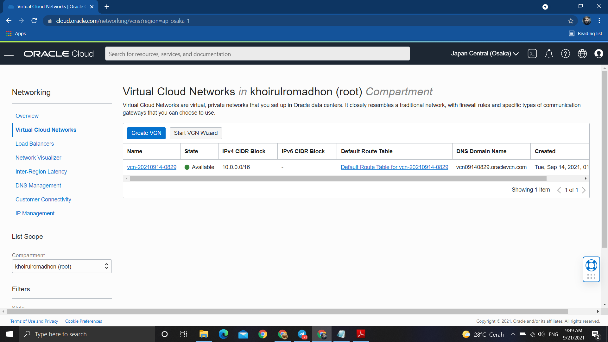
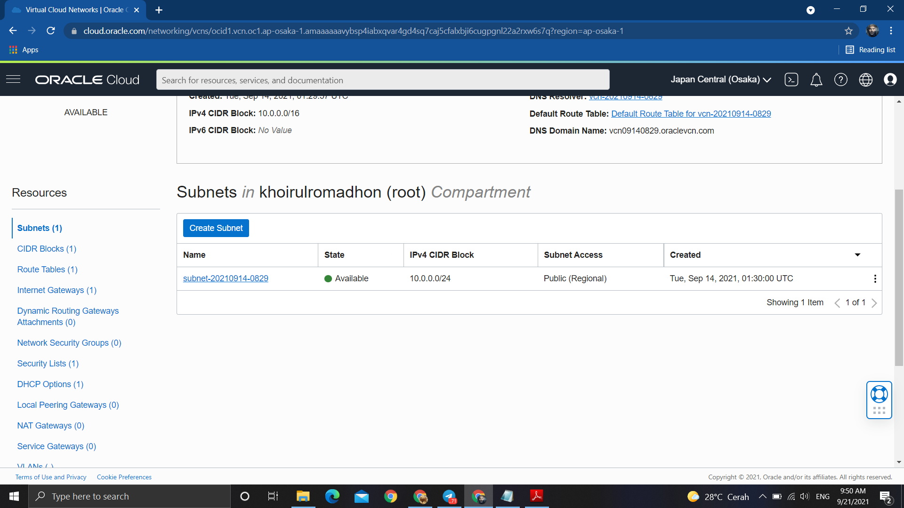
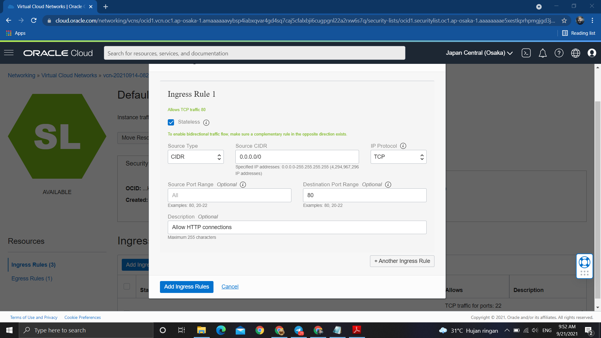
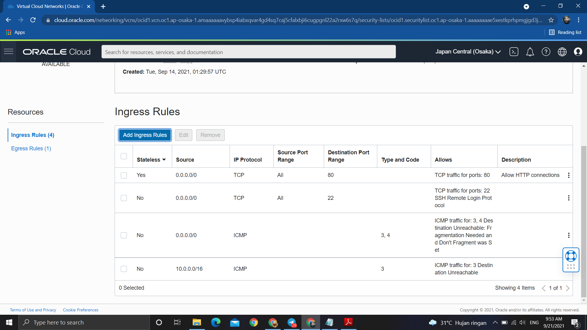
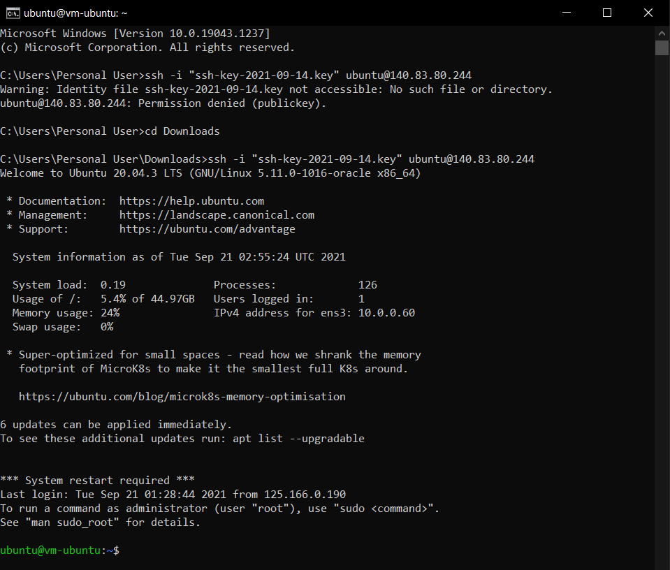
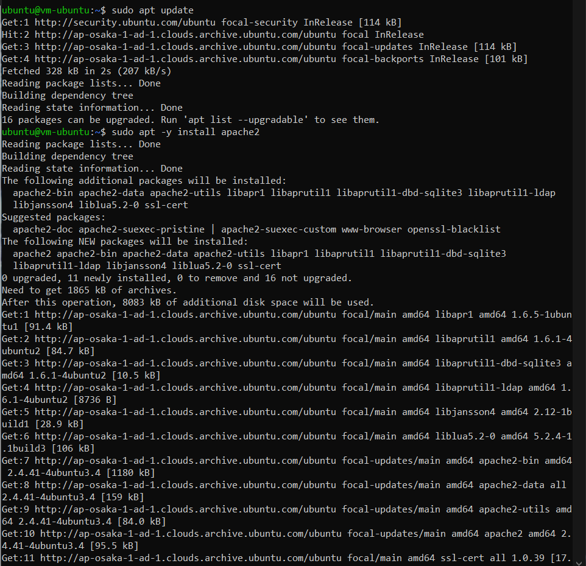
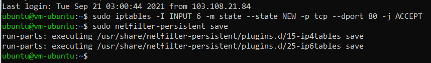

# 04 - VCN

## Tujuan Pembelajaran

1. Mengetahui layanan Oracle Cloud Infrastructure Networking
2. Mampu mengaktifkan port 80 melalui Virtual Cloud Network (VCN) di layanan Oracle Cloud
3. Mampu memasang Apache server dan mengonfigurasi IP tables Firewalls

## Hasil Praktikum

Praktikum 1

Masuk ke VCN

Masuk ke subnet VCN

Menambahkan Ingress Rules

Ingress Rules Berhasil ditambahkan

Praktikum 2

Akses ke VM

Menginstall Apache server

Menjalankan service apache

Update IPTables

Tugas

