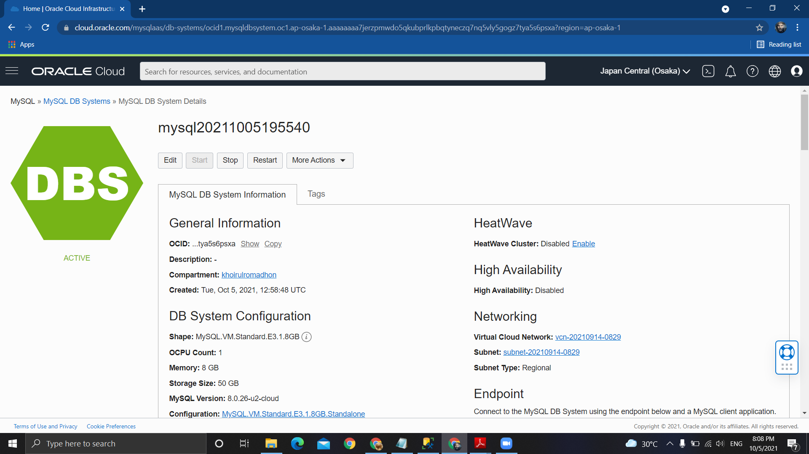
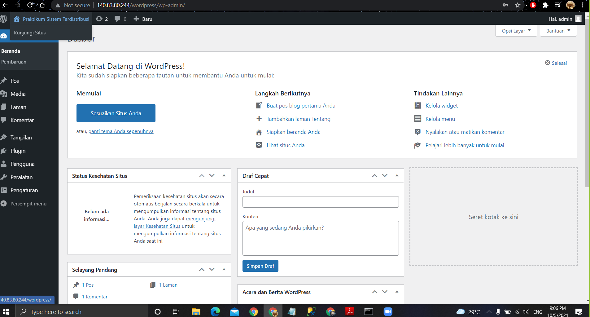

# 05 - Paas

## Tujuan Pembelajaran

1. Mengetahui layanan PaaS yang ditawarkan Oracle Cloud Infrastructure (OCI)
2. Dapat memanfaatkan layanan PaaS yang ditawarkan Oracle Cloud Infrastructure (OCI)

## Hasil Praktikum

Berhasil membuat database

Setting database

Hasil Wordpress

Tugas

