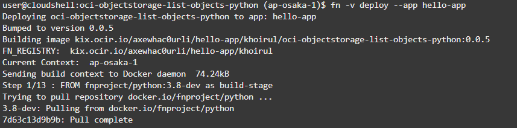

# 14 - Serverless

Nama Kelompok :
- Khoirul Romadhon
- Fransiska Lidya

## Tujuan Pembelajaran
1. Dapat memahami konsep Faas
2. Dapat mendeploy aplikasi dengan severless

## Hasil Praktikum
berikut adalah hasil praktikum:
1. membuka menu developer service - application pada oracle cloud

    
2. membuat application dengan spesifikasi sebagai berikut

    

3. mendeploy dengan perintah `fn`

    
4. menggunakan context berdasarkan region

    
5. update contect dengan compartment id

    
    
6. mengenerate auth token dan melakukan registrasi 

    
7. bukti bahwa setup telah berhasil

    
8. generate function hello-java

    
9. masuk ke directory hello-java

    
10. deploy aplikasi

    
11. running aplikasi

    
12. copy paste invoke endpoint dari function yang telah dibuat 

    
13. berikut adalah hasil dari running invoke 

    

## Tugas
Memilih salah satu function yang ada pada repository github. pada kasus ini, kami memilih function `oci-objectstorage-list-objects-python` untuk melihat isi dari bucket.

1. membuat folder oci-objectstorage-list-objects-python dan mengisikan dengan file-file yang ada pada repository github 
2. mengisikan nama bucket yang akan dipakai pada file func.py dan melakukan push ke repository github

    
3. membuka power shell pada application dan melakukann clonning terhadap github yang telah dipush sebelumnya

    
4. mendeploy aplikasi dengan perintah sebagai berikut

    
    

5. melakukan testing terhadap aplikasi
    

6. hasil dari deploy aplikasi yang menunjukkan isi dari bucket dengan nama `khoirulromadhon`
    

