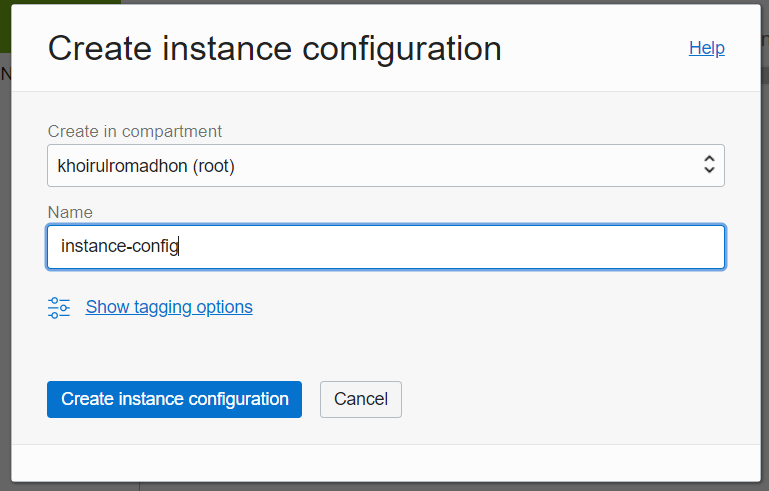
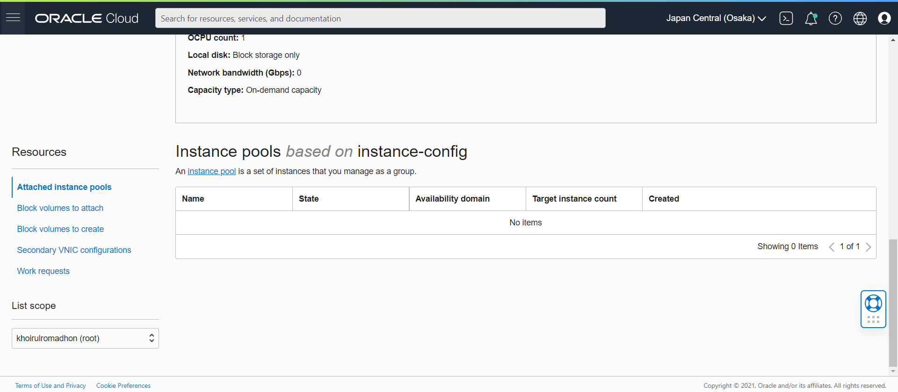
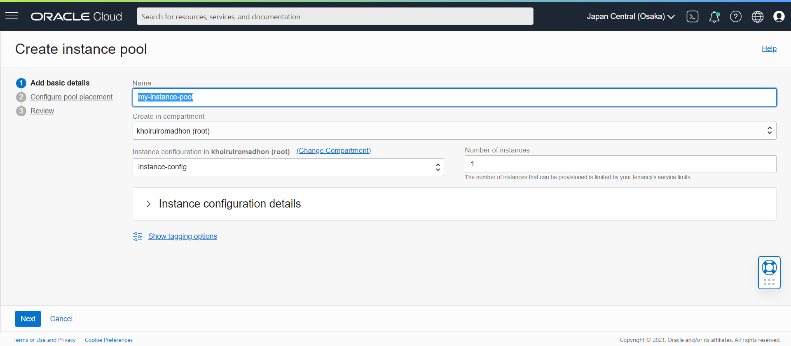
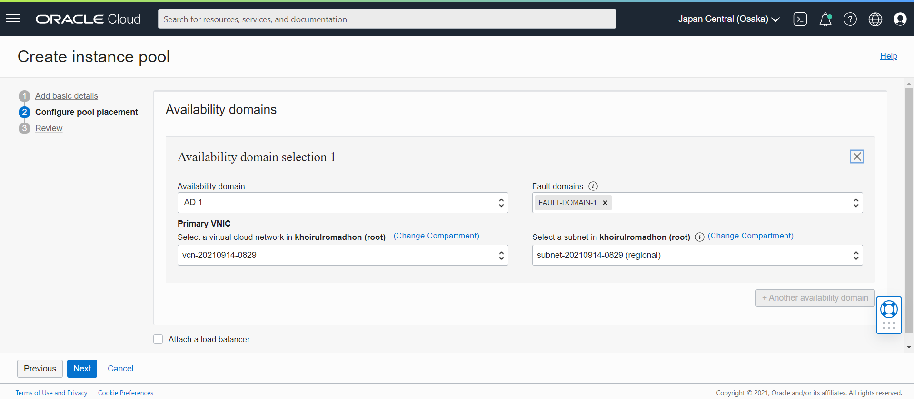
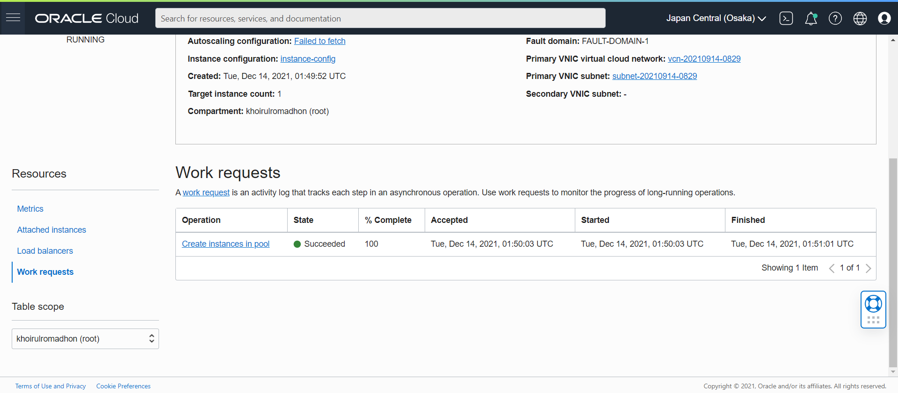
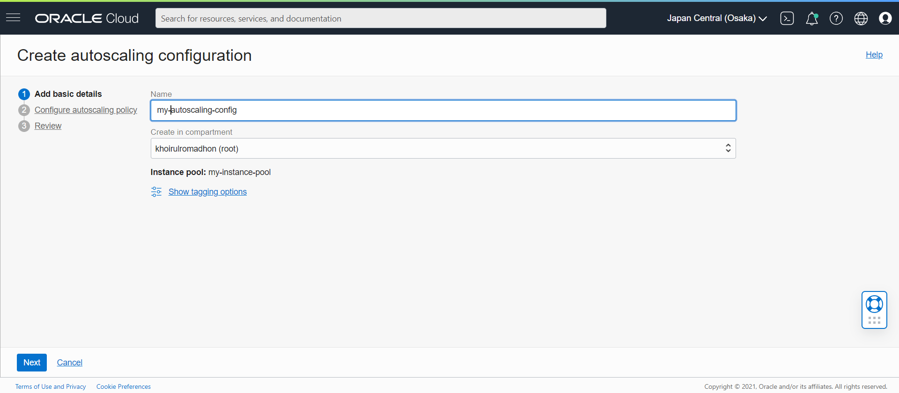
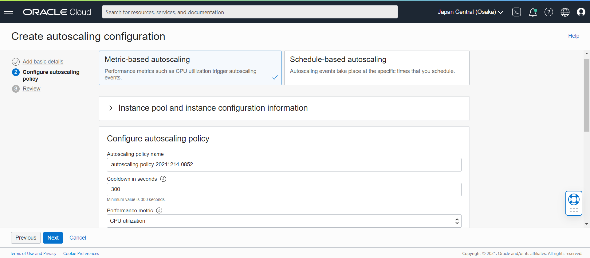
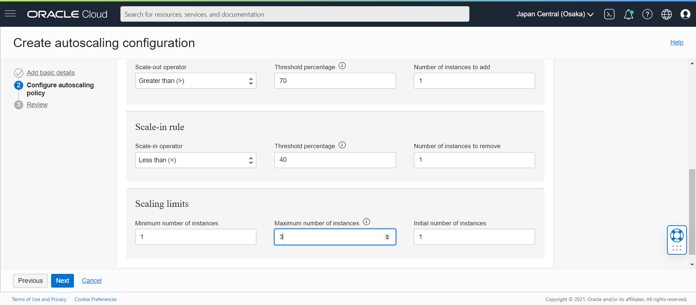
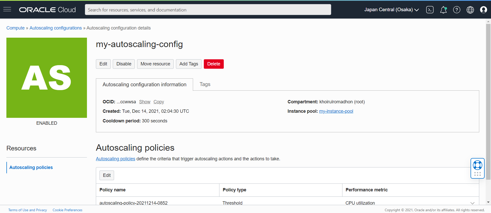

# 15 - AutoScalling Oracle Cloud

## Tujuan Pembelajaran

## Hasil Praktikum

--------------------------------------------
Auto Scaling adalah layanan yang secara otomatis menyesuaikan sumber daya komputasi berdasarkan volume permintaan pengguna. Ketika permintaan untuk sumber daya komputasi meningkat, Auto Scaling secara otomatis menambahkan instance ECS untuk melayani permintaan pengguna tambahan, atau secara alternatif menghapus instance jika terjadi penurunan permintaan pengguna.
